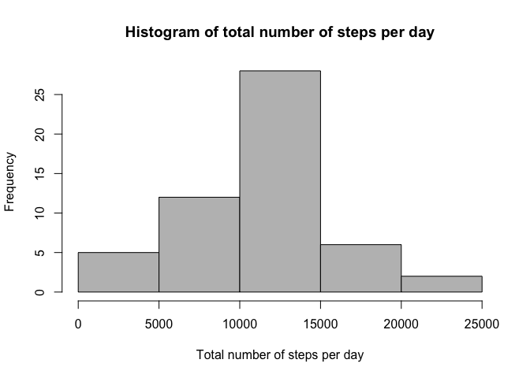
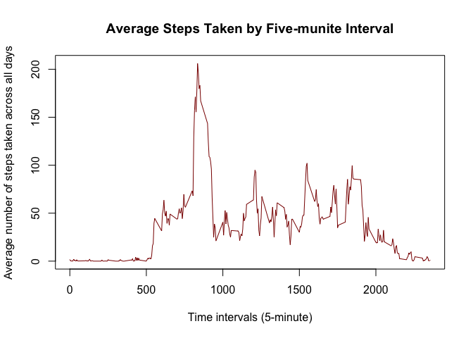
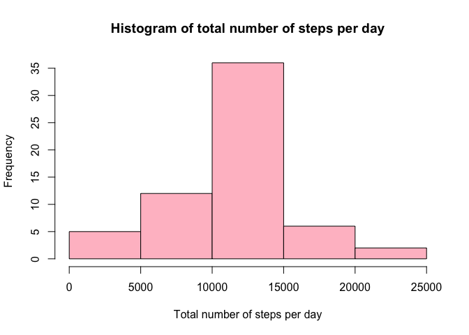
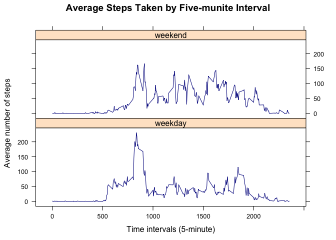

# Reproducible Research: Peer Assessment 1

This is an R Markdown document for the first project of the course Reproducible Research in Coursera Data Science Specialization. 

## Loading and preprocessing the data

The first step is to load and preprocess the data.The data file was downloaded on 16/08/2016 into the current working directory.


```r
date()
```

```
## [1] "Wed Aug 17 01:26:44 2016"
```

```r
fileUrl <- "https://d396qusza40orc.cloudfront.net/repdata%2Fdata%2Factivity.zip"
destfile <- "./activity.zip"
download.file(fileUrl, destfile = destfile)
data <- read.csv(unz("./activity.zip", "activity.csv"))
head(data)
```

```
##   steps       date interval
## 1    NA 2012-10-01        0
## 2    NA 2012-10-01        5
## 3    NA 2012-10-01       10
## 4    NA 2012-10-01       15
## 5    NA 2012-10-01       20
## 6    NA 2012-10-01       25
```

## What is the mean total number of steps taken per day?
I will ignore the missing values in the dataset in this part. 

```r
dataComp <- data[complete.cases(data),]
head(dataComp)
```

```
##     steps       date interval
## 289     0 2012-10-02        0
## 290     0 2012-10-02        5
## 291     0 2012-10-02       10
## 292     0 2012-10-02       15
## 293     0 2012-10-02       20
## 294     0 2012-10-02       25
```
### 1) calculate the total number of steps taken per day

```r
daySteps <- aggregate(steps ~ date, dataComp, sum)
head(daySteps)
```

```
##         date steps
## 1 2012-10-02   126
## 2 2012-10-03 11352
## 3 2012-10-04 12116
## 4 2012-10-05 13294
## 5 2012-10-06 15420
## 6 2012-10-07 11015
```
### 2) Make a histogram of the total number of steps taken each day

```r
hist(daySteps$steps, xlab = "Total number of steps per day",
     main = "Histogram of total number of steps per day", col = "grey")
```

<!-- -->

### 3) Calculate and report the mean and median of the total number of steps taken per day

```r
round(mean(daySteps$steps))
```

```
## [1] 10766
```

```r
median(daySteps$steps)
```

```
## [1] 10765
```

## What is the average daily activity pattern?
### 1) Make a time series plot (i.e. 𝚝𝚢𝚙𝚎 = "𝚕") of the 5-minute interval (x-axis) and the average number of steps taken, averaged across all days (y-axis)

```r
intervalSteps <- aggregate(steps ~ interval, dataComp, mean)
plot(intervalSteps$steps ~ intervalSteps$interval, type = "l",
     xlab = "Time intervals (5-minute)", ylab = "Average number of steps taken across all days",
     main = "Average Steps Taken by Five-munite Interval", col = "dark red")
```

<!-- -->

### 2) Which 5-minute interval, on average across all the days in the dataset, contains the maximum number of steps?

```r
intervalSteps[which.max(intervalSteps$steps),]
```

```
##     interval    steps
## 104      835 206.1698
```

## imputing missing values
### 1) Calculate and report the total number of missing values in the dataset (i.e. the total number of rows with 𝙽𝙰s)
```{4}
print(nrow(data) - nrow(dataComp))
```
### 2) Devise a strategy for filling in all of the missing values in the dataset. The strategy does not need to be sophisticated. For example, you could use the mean/median for that day, or the mean for that 5-minute interval, etc.
My strategy is to replayce the NA values in the original dataset with the average steps taken by 5-minute invertal calculated in the previous part. The demical values would be rounded to a whole number.

### 3) Create a new dataset that is equal to the original dataset but with the missing data filled in.

```r
steps <- data.frame(data$steps)
steps[is.na(steps),] <- ceiling(intervalSteps$steps)
data2 <- cbind(steps, data[,2:3])
colnames(data2) <- c("steps", "date", "interval")
head(data2)
```

```
##   steps       date interval
## 1     2 2012-10-01        0
## 2     1 2012-10-01        5
## 3     1 2012-10-01       10
## 4     1 2012-10-01       15
## 5     1 2012-10-01       20
## 6     3 2012-10-01       25
```
### 4) Make a histogram of the total number of steps taken each day and Calculate and report the mean and median total number of steps taken per day. Do these values differ from the estimates from the first part of the assignment? What is the impact of imputing missing data on the estimates of the total daily number of steps?
Here is the historgram of the total number of steps taken each day.

```r
daySteps2 <- aggregate(steps ~ date, data2, sum)
head(daySteps2)
```

```
##         date steps
## 1 2012-10-01 10909
## 2 2012-10-02   126
## 3 2012-10-03 11352
## 4 2012-10-04 12116
## 5 2012-10-05 13294
## 6 2012-10-06 15420
```

```r
hist(daySteps2$steps, xlab = "Total number of steps per day",
     main = "Histogram of total number of steps per day", col = "pink")
```

<!-- -->

Here are the mean and median.

```r
round(mean(daySteps2$steps))
```

```
## [1] 10785
```

```r
median(daySteps2$steps)
```

```
## [1] 10909
```

The values differ from the previous estimates. The old mean is 10766, and the new mean is 10785. The mean is increased. The old median is 10765. The new median is 10909. The median is also increased.So imputing the missing values increase the mean and median values.

## Are there differences in activity patterns between weekdays and weekends?
### 1) Create a new factor variable in the dataset with two levels – “weekday” and “weekend” indicating whether a given date is a weekday or weekend day.

```r
data2$day <- ifelse(weekdays(as.Date(data2$date)) %in% c("Sunday", "Saturday"), 
                    "weekend", "weekday")
head(data2)
```

```
##   steps       date interval     day
## 1     2 2012-10-01        0 weekday
## 2     1 2012-10-01        5 weekday
## 3     1 2012-10-01       10 weekday
## 4     1 2012-10-01       15 weekday
## 5     1 2012-10-01       20 weekday
## 6     3 2012-10-01       25 weekday
```

### 2) Make a panel plot containing a time series plot (i.e. 𝚝𝚢𝚙𝚎 = "𝚕") of the 5-minute interval (x-axis) and the average number of steps taken, averaged across all weekday days or weekend days (y-axis). See the README file in the GitHub repository to see an example of what this plot should look like using simulated data.

```r
intervalSteps2 <- aggregate(steps ~ interval + day, data2, mean)
library(lattice)
xyplot(steps ~ interval | day, data = intervalSteps2, type = "l", 
     xlab = "Time intervals (5-minute)", 
     ylab = "Average number of steps",
     main = "Average Steps Taken by Five-munite Interval", 
     layout = c(1,2), col = "dark blue", pwd = 2)
```

<!-- -->
